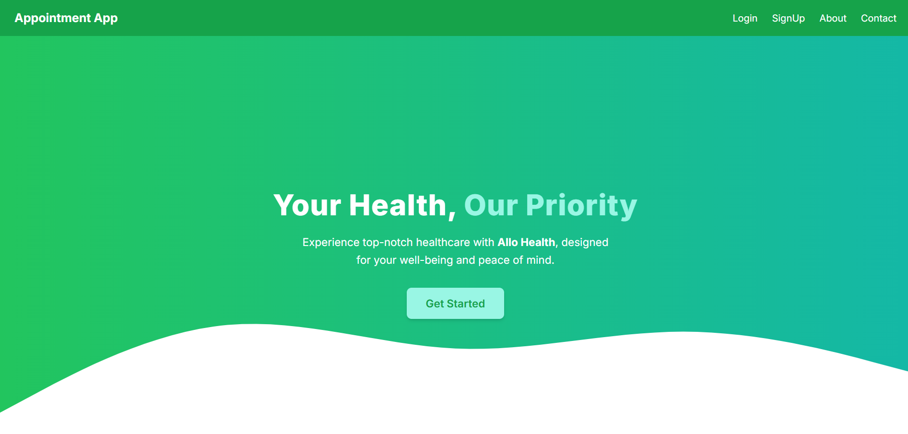

# Front Desk System at a Clinic

The **Front Desk System** is a web-based application designed to streamline patient queue and appointment management at a clinic. This system enables front desk staff to efficiently manage walk-in patients, book appointments, reschedule or cancel appointments, and track patient progress through the clinic.

---


## Features

### Authentication
- Secure login functionality for front desk staff using **JWT Authentication**.
- Role-based access control to ensure authorized actions.

### Queue Management
- Add walk-in patients to the queue and assign queue numbers.
- Update patient statuses such as **Waiting**, **With Doctor**, or **Completed**.
- View and manage the queue in real-time for efficient clinic operations.

### Appointment Management
- View available doctors and their time slots.
- Book, reschedule, or cancel appointments for patients.
- Track and update appointment statuses (**Booked**, **Completed**, **Canceled**).

### Doctor Management
- Add, edit, or delete doctor profiles, including:
  - Specialization
  - Gender
  - Location
  - Availability

### Search and Filter
- Search doctors by:
  - Specialization
  - Location
  - Availability

### View Appointments
- View all appointments for any patient or doctor.

---

## Technology Stack

### Backend
- **NestJS**: A scalable Node.js framework for building server-side applications.
- **JWT Authentication**: For secure login and authorization.
- **MySQL**: Database to store user, doctor, and appointment data.

### Frontend
- **Next.js**: React framework for server-side rendering and static web pages.
- **Tailwind CSS**: For fast and responsive UI styling.

---

## Key Components

### Front Desk Page
- User-friendly interface for managing doctor profiles, appointments, and queues.

### Queue Management Page
- Displays a list of patients in the queue, showing their queue number and current status.
- Options to update patient statuses (e.g., **Waiting**, **reschedule**, **Completed**).

### Appointment Management View
- Display available doctors and their time slots.
- Options to book, reschedule, or cancel appointments.

---

## Installation

### Prerequisites
- **Node.js** (v14+)
- **MySQL** (local or hosted database)

### Steps to Run the Application
1. **Clone the Repository**
   ```bash
   git clone https://github.com/kishlaychandan/AlloHealth
   cd front-desk-system
